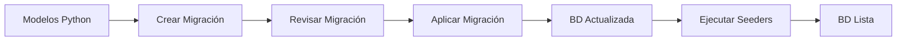

# 📚 Guía de Migraciones y Seeders - QR-FARM

## 🔄 Sistema de Migraciones

QR-FARM utiliza **Flask-Migrate** (basado en Alembic) para gestionar los cambios en la estructura de la base de datos de manera controlada y versionada.

## 📋 Conceptos Clave

### Migraciones
- **Definición**: Scripts que documentan cambios en la estructura de la base de datos
- **Propósito**: Mantener sincronizada la estructura de BD entre diferentes entornos
- **Contenido**: Solo estructura (tablas, columnas, índices), NO datos

### Seeders
- **Definición**: Scripts que insertan datos iniciales necesarios
- **Propósito**: Poblar la BD con datos base para el funcionamiento
- **Contenido**: Datos maestros (roles, tipos, configuraciones), NO datos de prueba

## 🛠️ Comandos de Migraciones

### Inicializar migraciones (solo primera vez)
```bash
flask --app backend/app.py db init -d backend/src/database/migrations
```

### Crear nueva migración
```bash
# Cuando modifiques modelos o estructura de BD
flask --app backend/app.py db migrate -m "Descripción del cambio" -d backend/src/database/migrations

# Ejemplos:
flask --app backend/app.py db migrate -m "Agregar campo telefono a usuarios"
flask --app backend/app.py db migrate -m "Crear tabla historial_medico"
flask --app backend/app.py db migrate -m "Agregar índice en campo codigo_qr"
```

### Aplicar migraciones pendientes
```bash
# Aplica todas las migraciones pendientes
flask --app backend/app.py db upgrade -d backend/src/database/migrations

# Aplicar hasta una migración específica
flask --app backend/app.py db upgrade <revision_id> -d backend/src/database/migrations
```

### Revertir migraciones
```bash
# Revertir la última migración
flask --app backend/app.py db downgrade -d backend/src/database/migrations

# Revertir hasta una migración específica
flask --app backend/app.py db downgrade <revision_id> -d backend/src/database/migrations

# Revertir todas las migraciones
flask --app backend/app.py db downgrade base -d backend/src/database/migrations
```

### Ver estado actual
```bash
# Ver migración actual
flask --app backend/app.py db current -d backend/src/database/migrations

# Ver historial de migraciones
flask --app backend/app.py db history -d backend/src/database/migrations

# Ver migraciones pendientes
flask --app backend/app.py db show -d backend/src/database/migrations
```

## 🌱 Sistema de Seeders

### Estructura de Seeders

```
backend/src/database/
├── seeders/
│   ├── __init__.py
│   ├── seeder_manager.py      # Gestor principal de seeders
│   └── seeder_config.json     # Configuración de seeders
```

### Ejecutar Seeders

```bash
# Ejecutar todos los seeders
python backend/src/database/seeders/seeder_manager.py

# Resetear y volver a ejecutar seeders
python backend/src/database/seeders/seeder_manager.py --reset
```

### Seeders Disponibles

1. **Roles** (`seed_roles`)
   - admin: Administrador del sistema
   - user: Usuario regular
   - veterinario: Veterinario con acceso médico
   - supervisor: Supervisor con acceso a reportes

2. **Tipos de Pasto** (`seed_tipos_pasto`)
   - Brachiaria
   - Estrella
   - Guinea
   - Kikuyo
   - Angleton

3. **Tipos de Vacunas** (`seed_tipos_vacuna`)
   - Fiebre Aftosa
   - Carbunco
   - Brucelosis
   - Rabia
   - Leptospirosis
   - IBR
   - DVB
   - Clostridiales

4. **Estados del Ganado** (`seed_estados_ganado`)
   - Sano
   - Enfermo
   - En tratamiento
   - En cuarentena
   - Recuperación
   - Preñada

## 📝 Flujo de Trabajo Recomendado

### Para nuevas características

1. **Modificar modelos** en `backend/src/models/`
2. **Crear migración**:
   ```bash
   flask --app backend/app.py db migrate -m "Descripción clara del cambio"
   ```
3. **Revisar migración** generada en `backend/src/database/migrations/versions/`
4. **Aplicar migración**:
   ```bash
   flask --app backend/app.py db upgrade -d backend/src/database/migrations
   ```
5. **Si requiere datos iniciales**, actualizar seeders

### Para sincronizar con el equipo

1. **Obtener cambios** del repositorio:
   ```bash
   git pull origin main
   ```
2. **Aplicar migraciones nuevas**:
   ```bash
   flask --app backend/app.py db upgrade -d backend/src/database/migrations
   ```
3. **Ejecutar seeders** si hay cambios:
   ```bash
   python backend/src/database/seeders/seeder_manager.py
   ```

## ⚠️ Mejores Prácticas

### ✅ DO (Hacer)

- **Siempre revisar** la migración generada antes de aplicarla
- **Crear migraciones pequeñas** y específicas
- **Usar nombres descriptivos** para las migraciones
- **Probar migraciones** en entorno de desarrollo primero
- **Documentar cambios** significativos en el commit
- **Mantener seeders idempotentes** (ejecutables múltiples veces)

### ❌ DON'T (No hacer)

- **No editar** migraciones ya aplicadas en producción
- **No incluir datos** de prueba en migraciones
- **No eliminar** migraciones del historial
- **No mezclar** cambios de estructura con datos en migraciones
- **No aplicar** migraciones sin backup en producción

## 🔧 Solución de Problemas

### Error: "Target database is not up to date"
```bash
# Actualizar a la última migración
flask --app backend/app.py db upgrade -d backend/src/database/migrations
```

### Error: "Can't locate revision identified by..."
```bash
# Verificar estado actual
flask --app backend/app.py db current -d backend/src/database/migrations

# Si es necesario, marcar como actualizado
flask --app backend/app.py db stamp head -d backend/src/database/migrations
```

### Error al crear migración automática
```bash
# Crear migración manual
flask --app backend/app.py db revision -m "Descripción" -d backend/src/database/migrations
# Luego editar el archivo generado manualmente
```

### Conflictos de migración en equipo
```bash
# 1. Identificar las migraciones en conflicto
flask --app backend/app.py db heads -d backend/src/database/migrations

# 2. Crear migración de merge
flask --app backend/app.py db merge -m "Merge migrations" -d backend/src/database/migrations

# 3. Aplicar la migración de merge
flask --app backend/app.py db upgrade -d backend/src/database/migrations
```

## 📊 Estructura de Archivos de Migración

```python
"""Descripción de la migración

Revision ID: 75b46c2713f7
Revises: 002
Create Date: 2025-11-05 16:39:32.681619
"""

from alembic import op
import sqlalchemy as sa

# Identificadores de revisión
revision = '75b46c2713f7'
down_revision = '002'

def upgrade():
    """Aplicar cambios a la BD"""
    # Crear tabla
    op.create_table('nueva_tabla',
        sa.Column('id', sa.Integer(), primary_key=True),
        sa.Column('nombre', sa.String(100), nullable=False)
    )
    
    # Agregar columna
    op.add_column('tabla_existente', 
        sa.Column('nueva_columna', sa.String(50))
    )
    
    # Crear índice
    op.create_index('idx_nombre', 'tabla', ['columna'])

def downgrade():
    """Revertir cambios de la BD"""
    # Eliminar índice
    op.drop_index('idx_nombre', 'tabla')
    
    # Eliminar columna
    op.drop_column('tabla_existente', 'nueva_columna')
    
    # Eliminar tabla
    op.drop_table('nueva_tabla')
```

## 🔄 Ciclo de Vida de la Base de Datos



## 📌 Comandos Rápidos para Desarrollo

```bash
# Resetear BD completamente (CUIDADO: Borra todos los datos)
flask --app backend/app.py db downgrade base -d backend/src/database/migrations
flask --app backend/app.py db upgrade -d backend/src/database/migrations
python backend/src/database/seeders/seeder_manager.py

# Actualizar BD con últimos cambios
git pull
flask --app backend/app.py db upgrade -d backend/src/database/migrations
python backend/src/database/seeders/seeder_manager.py

# Crear backup antes de migración
mysqldump -u root -p gestion_ganadera > backup_$(date +%Y%m%d_%H%M%S).sql
```

## 🎯 Casos de Uso Comunes

### Agregar nuevo campo a tabla existente
```bash
# 1. Modificar el modelo en backend/src/models/
# 2. Crear migración
flask --app backend/app.py db migrate -m "Agregar campo fecha_nacimiento a ganado"
# 3. Aplicar
flask --app backend/app.py db upgrade -d backend/src/database/migrations
```

### Crear nueva tabla
```bash
# 1. Crear nuevo modelo en backend/src/models/
# 2. Importar en app.py o donde se use
# 3. Crear migración
flask --app backend/app.py db migrate -m "Crear tabla historial_peso"
# 4. Aplicar
flask --app backend/app.py db upgrade -d backend/src/database/migrations
```

### Agregar datos maestros nuevos
```bash
# 1. Editar backend/src/database/seeders/seeder_manager.py
# 2. Agregar nuevos datos en el método correspondiente
# 3. Ejecutar seeders
python backend/src/database/seeders/seeder_manager.py
```

---

**Nota**: Siempre realiza backups antes de aplicar migraciones en producción.

Para más información, consulta la [documentación oficial de Flask-Migrate](https://flask-migrate.readthedocs.io/).