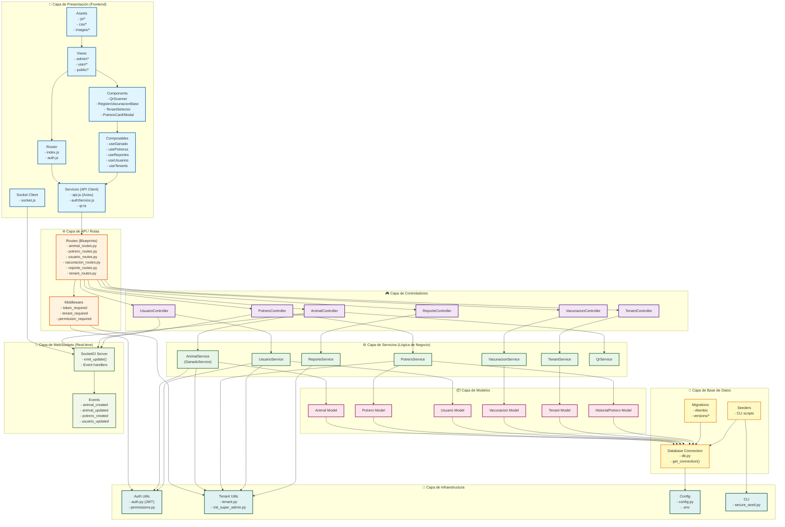

# Diagrama de Capas - QR-Farm

## Arquitectura del Sistema

Este diagrama muestra la arquitectura en capas del proyecto QR-Farm, siguiendo principios de arquitectura limpia y separación de responsabilidades.

## Descripción de Capas

### 🎨 Capa de Presentación (Frontend)
- **Views**: Componentes de página principales (admin, user, public)
- **Components**: Componentes reutilizables de Vue
- **Composables**: Lógica reactiva reutilizable (Vue 3 Composition API)
- **Services**: Cliente HTTP (Axios) y servicios de autenticación
- **Router**: Enrutamiento y navegación
- **Assets**: Recursos estáticos (JS, CSS, imágenes)
- **Socket Client**: Cliente WebSocket para actualizaciones en tiempo real

### 🌐 Capa de API / Rutas
- **Routes**: Blueprints de Flask que definen los endpoints REST
- **Middleware**: Decoradores de autenticación y autorización (`token_required`, `tenant_required`, `permission_required`)

### 🎮 Capa de Controladores
- **Controllers**: Orquestan las peticiones HTTP, validan entrada y formatean respuestas
- Cada controlador maneja un recurso específico (Animal, Potrero, Usuario, etc.)

### ⚙️ Capa de Servicios (Lógica de Negocio)
- **Services**: Contienen la lógica de negocio y reglas del dominio
- **QrService**: Generación y procesamiento de códigos QR
- Los servicios son independientes de la capa de presentación y base de datos

### 📦 Capa de Modelos
- **Models**: Representan las entidades del dominio
- Contienen la estructura de datos y métodos de transformación
- Son agnósticos de la base de datos

### 💾 Capa de Base de Datos
- **DB Connection**: Gestión de conexiones MySQL
- **Migrations**: Scripts de Alembic para versionado del esquema
- **Seeders**: Scripts para poblar datos iniciales

### 🔧 Capa de Infraestructura
- **Auth Utils**: JWT, validación de tokens, permisos
- **Tenant Utils**: Multi-tenancy, gestión de tenants
- **Config**: Configuración de la aplicación
- **CLI**: Comandos de línea para administración

### 📡 Capa de WebSockets (Real-time)
- **SocketIO Server**: Servidor WebSocket para actualizaciones en tiempo real
- **Events**: Eventos emitidos cuando hay cambios (creación, actualización, eliminación)

## Principios de Arquitectura

1. **Separación de Responsabilidades**: Cada capa tiene una responsabilidad única
2. **Dependencias Unidireccionales**: Las capas superiores dependen de las inferiores, nunca al revés
3. **Independencia de Framework**: Los servicios y modelos son independientes de Flask/Vue
4. **Testabilidad**: Cada capa puede ser testeada de forma independiente
5. **Escalabilidad**: Fácil agregar nuevas funcionalidades sin afectar otras capas

## Flujo de Datos

1. **Frontend** → Usuario interactúa con la interfaz
2. **API/Routes** → Recibe la petición HTTP y aplica middleware
3. **Controllers** → Valida y orquesta la petición
4. **Services** → Ejecuta la lógica de negocio
5. **Models** → Representa los datos del dominio
6. **Database** → Persiste o recupera datos
7. **WebSockets** → Emite actualizaciones en tiempo real a los clientes conectados

